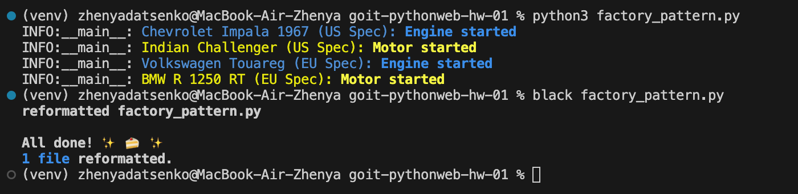
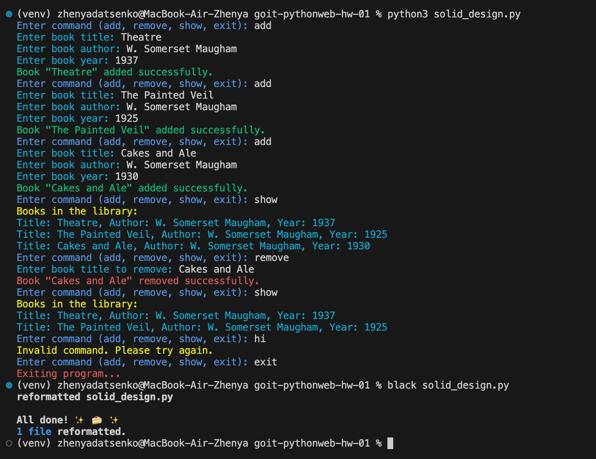

# Homework Description (Factory pattern & SOLID principles)

## Overview

This assignment consists of two tasks that focus on applying design patterns and principles in Python programming. The goal is to enhance your understanding of object-oriented programming concepts, specifically the Factory Pattern and SOLID principles.

## Tasks

### Task 1: Factory Pattern

- Implement a system for creating vehicles using the Factory Pattern.
- Create an abstract base class `Vehicle` with a method `start_engine()`.
- Modify the existing `Car` and `Motorcycle` classes to inherit from `Vehicle`.
- Create an abstract class `VehicleFactory` with methods `create_car()` and `create_motorcycle()`.
- Implement two factory classes: `USVehicleFactory` and `EUVehicleFactory` to create vehicles with regional specifications.
- Update the initial code to utilize these factories for vehicle creation.

### Task 2: SOLID Principles

- Refactor a library management program that allows adding, removing, and displaying books.
- Create a `Book` class to adhere to the Single Responsibility Principle (SRP).
- Ensure the `Library` class is extendable without modification to comply with the Open/Closed Principle (OCP).
- Implement the Liskov Substitution Principle (LSP) by ensuring any class inheriting from `LibraryInterface` can replace the `Library` class seamlessly.
- Use the `LibraryInterface` to specify necessary methods for interaction, following the Interface Segregation Principle (ISP).
- Ensure higher-level classes depend on abstractions, adhering to the Dependency Inversion Principle (DIP).

## Screenshots of the Outcome

- 
- 
